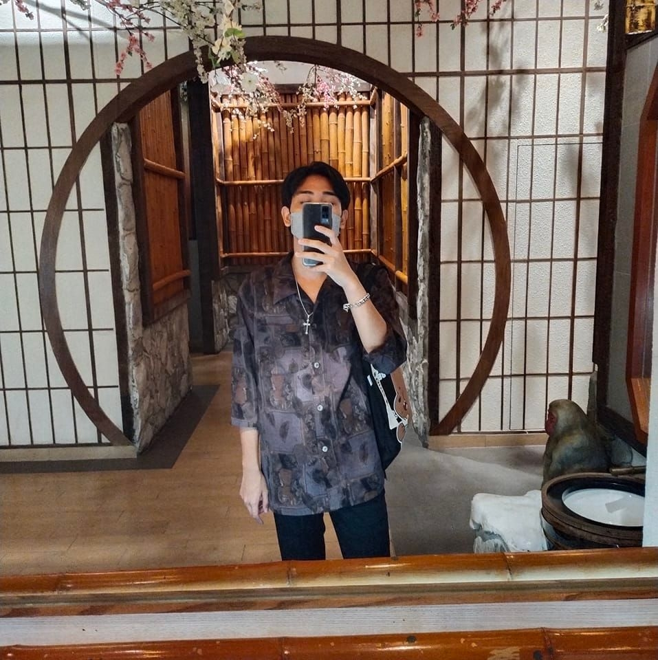

Hi My name is sirawit
===============================================================================================================================

undergraduate student
---------------------

เริ่มเรียนที่ราชภัฏพระนครมา 4ปีแล้ว เป็นนักศึกษาหาที่ฝึกงาน

* 🌍  I'm based in Bangkok , Thailand
* ✉️  You can contact me at [sirawit.15copter@gmail.com](mailto:sirawit.15copter@gmail.com)
* 🧠  I'm learning Phranakhon Rajabhat University
* ⚡  ชอบที่จะได้ไปท่องเทียวที่ต่าง ชอบที่จะทำอาหารอ่างหนังสือยามว่าง

### Skills

### Socials

   

### Badges

<b>My GitHub Stats</b>

<html>
<head>
<h1 style="text-align: left;"><strong>&nbsp;นายสิรวิชญ์ เหรียญแพคงคา </strong></h1>
<h2 style="color:Tomato;text-align: left;"><strong>&nbsp;เกิดวันที่ 15 สิงหาคม ปี 2002 </strong></h2>
<h3 style="text-align: left;"><strong>&nbsp; - เชื้อชาติ ไทย</strong></h3>
<h3 style="text-align: left;"><strong>&nbsp; - สัญชาติ ไทย</strong></h3>
<h3 style="text-align: left;"><strong>&nbsp; - ศาสนา พุทธ</strong></h3>
<h2 style="color:Tomato;text-align: left;"><strong>&nbsp;ข้อมูลการศึกษา &#128513;</strong></h2>
<h3 style="text-align: left;"><strong>&nbsp; - มหาวิทยาลัยราชภัฏพระนคร สาขาอิเล็กทรอนิกส์คอมพิวเตอร์</strong></h3>
  
<a href="https://pnru.ac.th" target="blank">เว็บมหาลัย</a>

<h2 style="col7                                                                                                                             
<a href="https://www.facebook.com/profile.php?id=100010493555830" target="blank">เฟส</a>

<h2 style="col7                                                                                                                                                                                                                                                                                                                                                                                                                                                                                                                                                                                                                                                                                                                                                                                                                                                                                                                                                                                                                                                                                                                                                                                                                                                                                                                                                                                                                                                                                                       or:Tomato; text-align: left;"><strong>&nbsp; งานอดิเรก &#128516;</strong></h2>
<h3><em><strong>&nbsp; - ดูหนัง / ฟังเพลง / เล่นเกม / อ่านการ์ตูน</strong></em></h3>

  
  
  
  
  </body>
</html>
